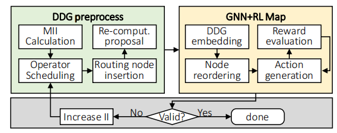
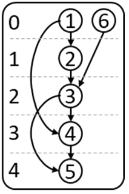

# GNN-RL-Map

GNN-RL-Map is a high-quality mapper to map data flow graphs (DFGs) to CGRAs. It integrates routing explorations (e.g., PE routing, LRF routing, GRF routing, etc.) into the mapping process toward high-quality mapping. With a reduced resource graph defined, the searching space of GNN-RL-Map would not be greatly increased. To efficiently solve the problem, it introduces graph neural network (GNN) based reinforcement learning (RL) to predict a placement distribution over different resource nodes for all operations in a DFG. Using the routing connectivity as the reward signal, it optimizes the parameters of a neural network to find a valid mapping solution with a policy gradient method. Without much engineering and heuristic designing, GNN-RL-Map achieves considerable improvement in mapping quality. Please find the [paper](https://ieeexplore.ieee.org/stamp/stamp.jsp?tp=&arnumber=10069423) for more references.


## Table of contents
1. [Overview](#overview)
    1. [Directory Structure](#directory-structure)
2. [Getting Started](#getting-started)
    1. [Requirement](#requirement)
    2. [Running Example](#running-example)
    3. [Modify the parameters](#modify-the-parameters)
3. [Reference](#publication)


# Overview

The entire process and an example of the mapping are shown below:

 \
 


## Directory Structure

```
GNN-RL-Map
│   README.md
│   flow_diagram.png
│   Mapping_diagram.png
│   Agent.py 
│   config.py (Read the configuration from the script)
│   dataGenerator.py (Generate dataset)
│   environment_routing.py (Including state, action, reward, etc)
│   graph_routing.py (Adding routing nodes)
│   main.py 
│   minPE.py (ILP solution scheduling)
│   Networks.py (Network structure)
│   run.sh (Run script)
└───data (Graph data)
```

# Getting started
## Requirement:
* Ubuntu (we have tested Ubuntu 18.04)
* tensorflow2.6.0

## Running Example:
```
bash run.sh demo
```

## Modify the parameters
If you want to modify the parameters of the code, open the run.sh file and modify the specified parameter information
The following is an explanation of some key parameters
* src_file_path(For example, data/o22m.txt is the 22nd kernel)
* actor_lr(Representation learning rate)
* gcn_dims(Indicates the hidden layer dimension)
* max_iteration(Indicates the maximum number of iterations)
* batch_size(Represents the number of samples in a batch)
* pea_width(Indicates the scale of the CGRA. For example, 6 indicates that the scale of the CGRA is 6x6)
* reward_mode(Indicates the CGRA structure, 1 indicates the mesh structure, 2 indicates the torus structure, 3 indicates the Diagonal structure, and 4 indicates the 1-HOP structure)
* max_LRF(the number of LRF resources in one FU)
* max_memory(the number of LSU resources in a time slot)
* max_GRF(the number of GRF resources in a time slot)

## Data Formats
Each line of the input file indicates a node in a DFG, which includes 13 segments defined as follows:
```
|----------|------------|-------------|------------|-------------|------------|-------------|------------|-------------|---------------------|-------------------|----------------|---------------|
|node index|child node 1|edge 1's type|child node 2|edge 2's type|child node 3|edge 3's type|child node 4|edge 4's type|earliest control step|latest control step|is routing node?|zero in-degree?|
|----------|------------|-------------|------------|-------------|------------|-------------|------------|-------------|---------------------|-------------------|----------------|---------------|
```

For example: \
 \
it should be: \
1 2 0 4 0 0 0 0 0 0 0 0 0 \
2 3 0 0 0 0 0 0 0 1 1 0 1 \
3 4 0 5 0 0 0 0 0 2 2 0 1 \
4 5 0 0 0 0 0 0 0 3 3 0 1 \
5 0 0 0 0 0 0 0 0 4 4 0 1 \
6 3 0 0 0 0 0 0 0 0 1 0 0

# Publication

```
@inproceedings{zhuang2022towards,
  title={Towards High-Quality CGRA Mapping with Graph Neural Networks and Reinforcement Learning},
  author={Zhuang, Yan and Zhang, Zhihao and Liu, Dajiang},
  booktitle={Proceedings of the 41st IEEE/ACM International Conference on Computer-Aided Design (ICCAD)},
  pages={1--9},
  year={2022}
}
```
